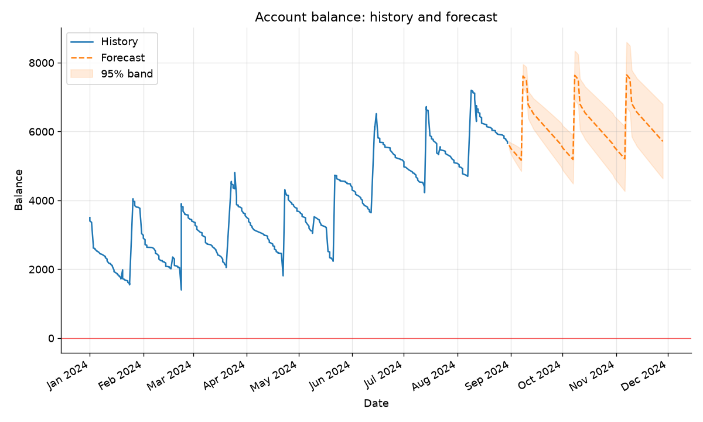
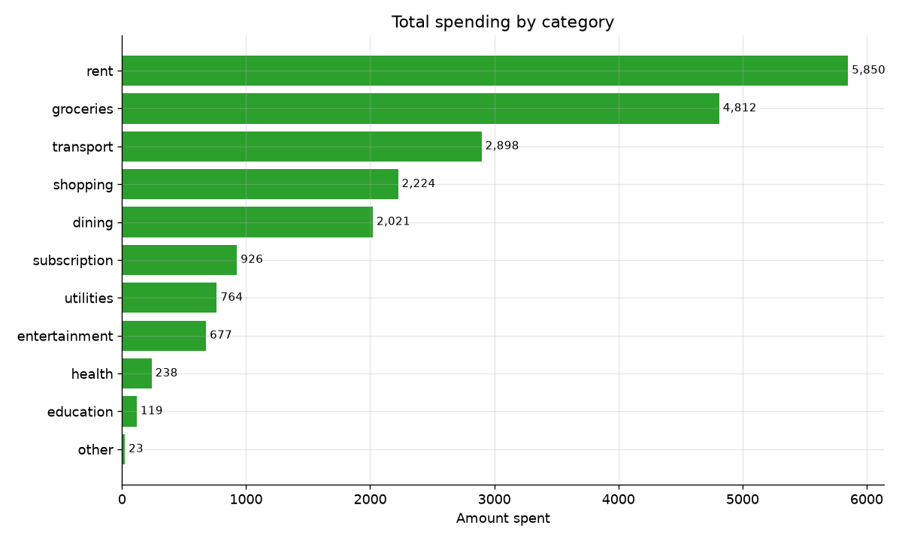
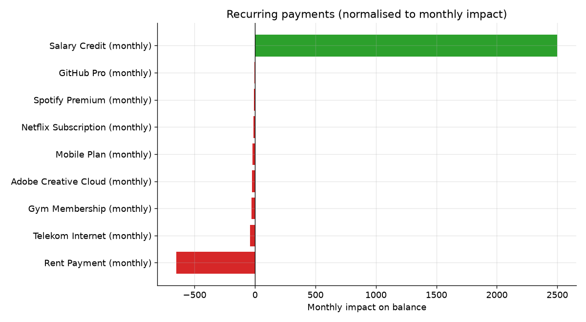

# FinSight Project Report

**A financial-analysis tool for recurring-payment detection, balance
forecasting, and savings recommendations.**

Author: Lokesh Pandit
Course: Programming with Python
Environment: Python 3.10+ on Ubuntu 24.04

---

## 1. Motivation and problem statement

Most people have access to a long list of bank transactions but very
little insight drawn *from* that list. Three questions come up repeatedly:

1. *Where does my money regularly go?*: subscriptions and bills tend to
   accumulate silently.
2. *Will I have enough money in the coming weeks?*: a forward view of the
   balance is more useful than the current number alone.
3. *What should I do about it?*: the raw numbers need to be turned into
   plain, actionable guidance.

**FinSight** answers these three questions from a single CSV of
transactions. It is delivered as an installable Python package with both a
command-line interface and a clean library API. The design goal was a tool
that is genuinely useful, transparent in its reasoning, and easy to test
rather than a black-box model.

### The dataset

The project is driven by a real 8-month transaction history
(`data/sample_transactions.csv`, 477 rows, January-August 2024) with the
columns `date`, `description`, `amount`, `type` and `category`. Amounts are
stored **unsigned**, with a `type` column of `credit` / `debit` giving the
direction a common bank-export convention. The history contains regular
income (a monthly salary plus irregular freelance payments), fixed monthly
subscriptions, rent, variable utility bills, and a large volume of
irregular everyday spending across categories such as groceries, dining and
transport. At 15 KB it is committed directly to the repository, well under
the 50 MB limit. A small synthetic generator (`datagen.py`) is retained as
an optional utility for producing extra test data.

---

## 2. Overview of the approach

The pipeline has four stages, each in its own module:

```
CSV ──▶ loader ──▶ recurring detection ──▶ forecasting ──▶ recommendations
                        │                        │               │
                        └────────────── report / charts ─────────┘
```

1. **Loading** (`loader.py`): parse a CSV into typed `Transaction`
   objects, tolerating different column names, date formats and number
   styles. When a `type` (credit/debit) column is present, the loader
   applies the correct sign so that unsigned exports are handled
   transparently.
2. **Recurring detection** (`recurring.py`): find groups of transactions
   that repeat on a regular schedule.
3. **Forecasting** (`forecast.py`): project the balance forward using the
   detected recurring cash flows plus a model of discretionary spending.
4. **Recommendations** (`recommend.py`): apply transparent rules to the
   resulting figures to produce prioritised, human-readable advice.

`analysis.py` orchestrates the stages and renders a text report;
`visualize.py` produces charts saved as PNG files.

Because real statements are private, `datagen.py` produces a reproducible
synthetic history so the whole tool can be demonstrated and tested without
personal data.

---

## 3. Data model

Three small, typed `dataclasses` (in `models.py`) carry state through the
pipeline:

- **`Transaction`**: a dated, signed money movement with a description and
  optional category. Positive amounts are credits, negative are debits.
- **`RecurringPayment`**: a detected repeating group, carrying its
  frequency, typical amount, number of occurrences, date range and an
  `amount_variability` score. A `monthly_impact` property normalises every
  frequency to a comparable per-30-day figure.
- **`Forecast`**: parallel lists of future dates and projected balances,
  plus a confidence band, with helpers such as `first_negative_date()`.

Frequencies are modelled as an `enum` (`Frequency`) whose members know
their own length in days, which keeps the projection logic simple.

---

## 4. Recurring-payment detection

This is the analytical core. The algorithm works in four steps.

**Step 1: Normalisation and grouping.** Each description is reduced to a
stable "merchant key" by lower-casing and stripping digits and
punctuation, so `"SuperMart 0453"` and `"SUPERMART"` collapse together.
Transactions are grouped by this key.

**Step 2: Amount consistency.** A group is only a candidate if all its
amounts share the same sign and their *coefficient of variation*
(`std / |mean|`) is below a tolerance. This admits fixed subscriptions
(variation ≈ 0) and mildly variable bills such as electricity, while
rejecting noisy one-off merchants like a supermarket.

**Step 3: Interval regularity.** The days between consecutive charges are
computed. Their coefficient of variation must be small (the schedule must
be regular), and the **median** interval is used as the representative
period the median is robust to the occasional missed or doubled charge.

**Step 4: Frequency classification.** The median interval is matched
against a table of known periods with tolerances:

| Frequency  | Nominal days | Tolerance |
|------------|-------------:|----------:|
| weekly     | 7            | ±2        |
| biweekly   | 14           | ±3        |
| monthly    | 30.4         | ±5        |
| quarterly  | 91.3         | ±12       |
| yearly     | 365          | ±25       |

Groups with at least `min_occurrences` (default 3) matching charges are
reported, sorted by absolute monthly impact so the most significant items
appear first.

Design choices worth noting: using the **median** (rather than the mean)
for both the interval and the typical amount makes detection resilient to
outliers; and the two tolerance parameters are exposed so callers can trade
precision against recall.

---

## 5. Balance forecasting

The forecast combines a deterministic and a stochastic component.

**Scheduled cash flows.** Every detected recurring payment is projected
onto its future due dates by repeatedly adding its period length to the
last observed date. On each future day, any recurring charge landing that
day is applied to the running balance.

**Discretionary spending.** Everything that is *not* recurring is modelled
as an average daily drain. Over a recent look-back window (default 90
days), non-recurring debits are summed per day; zero-spend days are
included so the average is not overstated. The mean daily spend is applied
to every future day.

**Confidence band.** The standard deviation of daily discretionary spend is
accumulated as a variance that grows linearly with the horizon (a
random-walk assumption), giving a `±1.96σ` (~95%) band that widens over
time. This communicates that near-term projections are more trustworthy
than distant ones.

The output is a day-by-day `Forecast`, from which the tool derives the
final balance, the lowest projected point, and the first date (if any) the
balance would go negative.

---

## 6. Recommendations

Recommendations are deliberately **rule-based and transparent** rather than
learned; every message can be traced to a concrete figure. Each carries a
priority (`CRITICAL` / `WARNING` / `INFO`) and the list is sorted by
severity. The rules cover:

- **Liquidity risk**: if the forecast dips below zero (critical) or runs
  low relative to the current balance (warning).
- **Savings rate**: computed as `(income-spending) / income` over the
  history, flagged as unsustainable (< 0), low (< 10%) or healthy.
- **Emergency buffer**: the current balance expressed in months of typical
  spending, against the common 3-6 month rule of thumb.
- **Subscription load**: the share of income consumed by small, fixed
  recurring charges, with the offending items listed.
- **Recurring summary**: a plain restatement of monthly recurring income
  vs. expenses.

The report closes with an explicit disclaimer that the output is a
description of the user's own numbers, not professional financial advice.

---

## 7. Results

Run on the bundled 8-month history (starting balance 1000), FinSight
correctly reads the unsigned amounts via the `type` column and detects nine
monthly recurring payments: the €2,500 salary, €650 rent, and seven fixed
subscriptions (Telekom, Gym, Adobe, Mobile, Netflix, Spotify, GitHub Pro).
It reports monthly recurring income of €2,500 against €792.93 of recurring
expenses, a recurring net of about +€1,707 before discretionary spending.

The detector correctly *excludes* the irregular items- the variable
"Freelance Project Payment" income and the fluctuating utility bill fall
outside the amount/interval regularity thresholds which is the desired
behaviour, since those are not dependable recurring cash flows.

Over the whole period the true savings rate is about 18% (~€585/month), and
the current balance covers roughly 2.2 months of spending. The
recommendation engine surfaces exactly these two findings: a *warning* that
the emergency buffer is thin (below the 3-month rule of thumb) and an *info*
note that the savings rate is healthy but the surplus could be earning
more. The 90-day forecast projects the characteristic monthly saw-tooth
forward with a widening confidence band.

Three charts are produced and saved to `outputs/`:

**Balance history and forecast**: the characteristic monthly saw-tooth
(salary in on payday, spending out over the month) with the dashed forecast
and its confidence band:



**Spending by category**: where money actually goes:



**Recurring payments**: every detected item on one comparable monthly
scale, income and expenses distinguished by colour:



---

## 8. Software engineering

- **Packaging.** A `src/`-layout, installable via `uv pip install -e .`,
  defined entirely in `pyproject.toml` with a `hatchling` build backend and
  a console entry point. Runnable as `uv run -m finsight`.
- **Structure.** Nine focused modules; reusable functions and classes; the
  public API re-exported from the top-level `__init__.py` so users can
  `from finsight import analyse`.
- **Documentation.** Every module, class and public function has a
  docstring; the README and this report cover usage and methodology; a
  Jupyter notebook demonstrates the library API.
- **Testing.** 17 `pytest` tests cover detection (positive and negative
  cases), forecasting behaviour, number/date parsing and an end-to-end
  round-trip through generated data.
- **Style.** The code passes `ruff check` under a configuration selecting
  the pycodestyle, pyflakes, isort, naming, pyupgrade and bugbear rule
  sets, with a 79-character line limit.
- **Headless output.** Matplotlib uses the `Agg` backend and always saves
  to file, so the tool runs on the grading server without a display.

---

## 9. Limitations and future work

- Detection currently keys on the description text; noisy real-world memo
  fields could be handled better with fuzzy matching or clustering.
- The discretionary-spending model is a simple stationary average; a
  seasonal or day-of-week model would improve realism.
- The confidence band assumes independent daily spend; correlated spending
  (e.g. holidays) would need a richer model.
- Categories are taken as given; automatic categorisation from the
  description would remove that dependency.
- Multi-currency and transfer-between-own-accounts handling are out of
  scope for this version.

Despite these simplifications, FinSight reliably recovers the recurring
structure of a realistic history, produces a sensible forward view, and
turns both into clear, prioritised guidance meeting the goal of a small
but genuinely useful financial tool.
